# Creating Your First Django Web Project App
In this repo, you will learn how to create your first project in Django

## Tools: 
	VS Code
	
## Pre-Requisite:
	Python3
	Pip 

## Verify it is installed or not, run below commands on cmd
  	python --version
	pip --version

### If not installed, then Download and install:
	Python3 from  https://www.python.org/downloads/
	Pip from https://pip.pypa.io/en/stable/installation/

## Get Started With Django first project
Open vs code and type following commands on terminal:	
	mkdir "Django Project"
	cd "Django Project"

## Setup virtual environment:
	python -m venv venv
	virtualenv venv
	venv\Scripts\Activate

Note: Do Only if you face issue in creating virtualenv, run powershell as a admin
### Run following command
	get-ExecutionPolicy 		
if it give "restricted"
### Run the following command
	Set-ExecutionPolicy -ExecutionPolicy RemoteSigned -Scope LocalMachine
Type 'Y' to enable
After enabling, run the following command
	get-ExecutionPolicy 
Now, it should give "remotesigned"

## Now run the following command again
venv\Scripts\Activate 
(now you can see (venv)) in your terminal
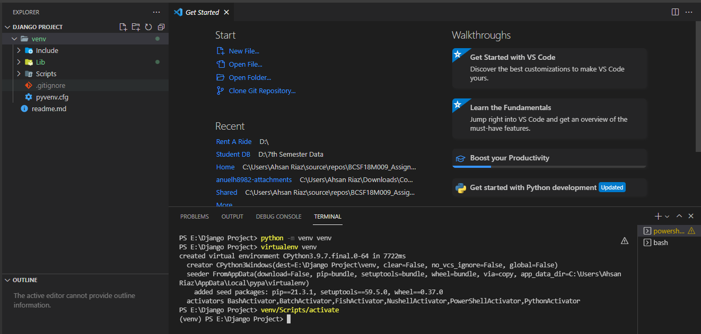

## Installing Django
	pip install django
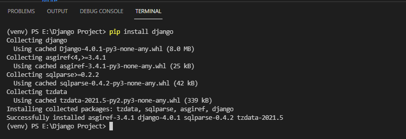

## Creating Project
	djagno-admin startproject myproject

## Change Directory to your project
	cd myproject
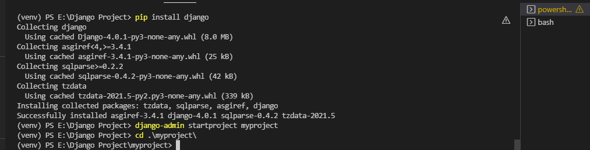

### Contents of myproject directory
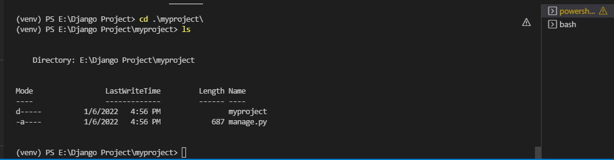	
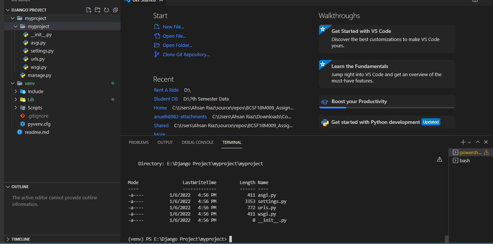
 
## Run Django server 
	python manage.py runserver [port]
Note: here port is optional, by default port is 8000
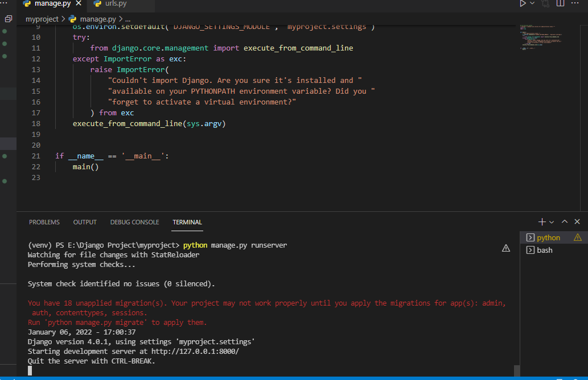

### Run:
	start localhost:8000/
	start 127.0.0.1:8000/
## e.g:	
	python manage.py runserver 9000		
Now it will run our django server with 9000
### Run:	
	start localhost:9000/
	start 127.0.0.1:9000/
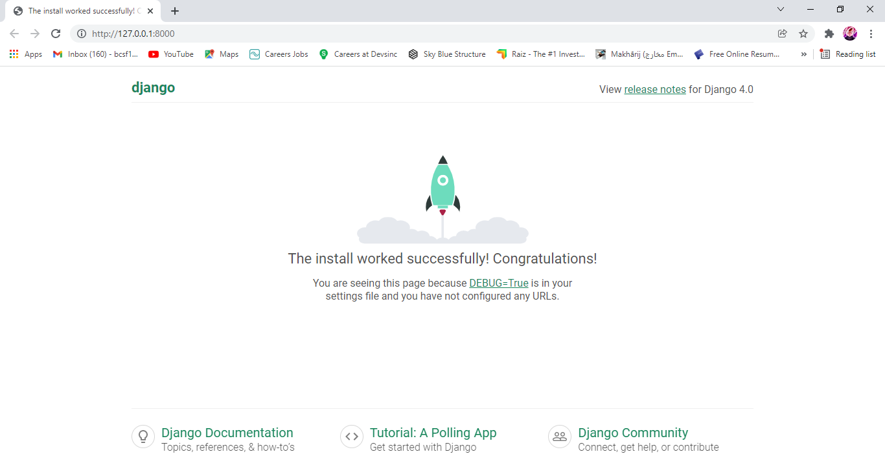

	
#### By defaul Django project admin panel, we can check it using
	start localhost:8000/admin/
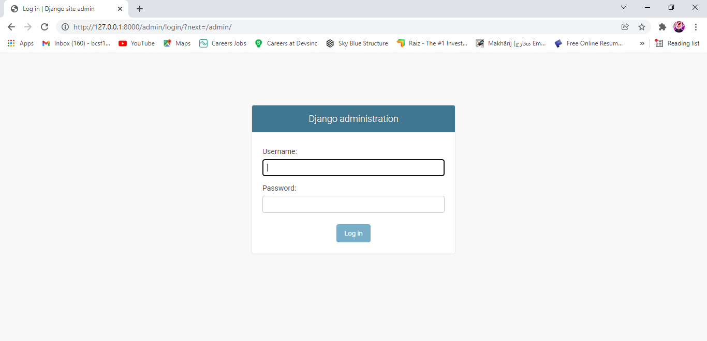

## Create App in django-project
	django-admin startapp myapp
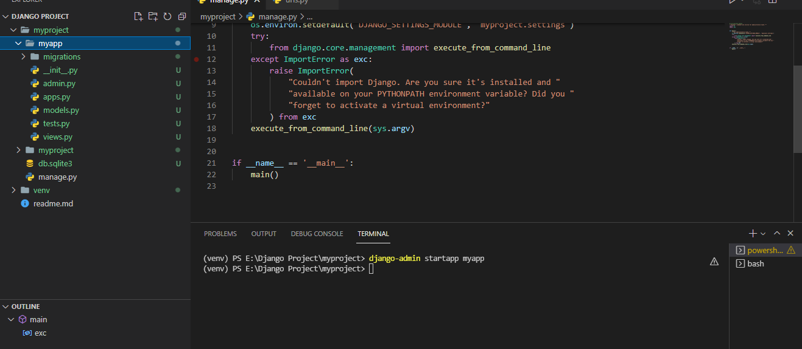	

Now, Add 'myapp' in INSTALLED_APPS list of setting file of your project 'myapp'.
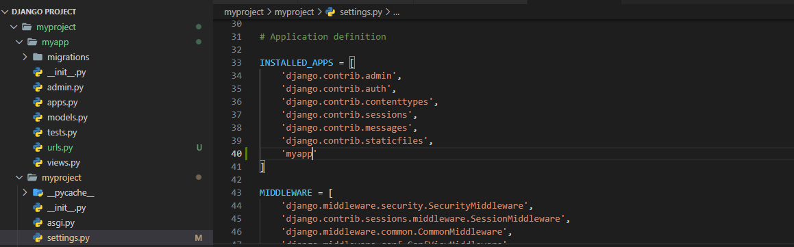

## Create urls.py file in myapp directory and write this code
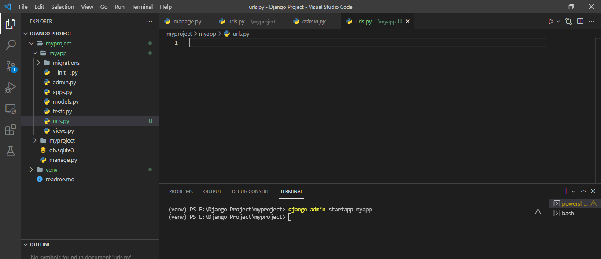	
	from django.urls import path
	from . import views

	# URL endpoints for app
	urlpatterns = [
		
	]
	
## Goto urls.py file of myproject directory, first import include from 'django.urls
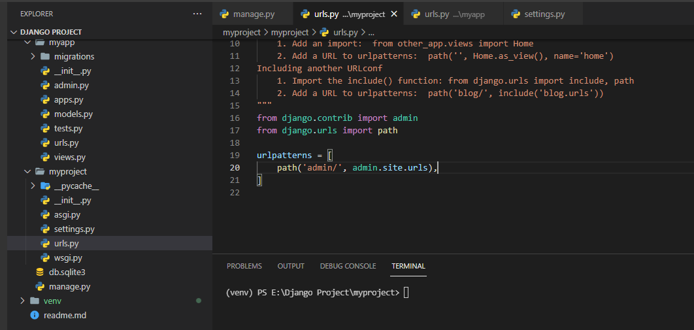	
	from django.urls import path, include

### In urlpatterns of urls.py of myproject, type 
	path('myapp/',include('myapp.urls')),
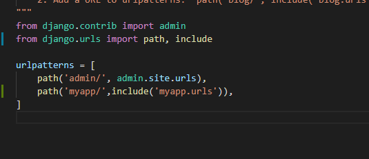

## Now goto urls.py of myapp, and write url pattern
	path('',views.index)

### urls.py should look like:
	from django.urls import path
	from . import views

	# URL endpoints for app
	urlpatterns = [
		path('',views.index)
	]
	

## Goto views.py and write function
	from django.shortcuts import render, HttpResponse

	# Create your views here.
	def index(request):
		return HttpResponse("Hello World")
		
## Now goto, myproject directory and run the django server
	python manage.py runserver
## Open browser and type:
open localhost:8000/myapp/ or 127.0.0.1:8000/myapp/

## Now, page will show "Hello World"
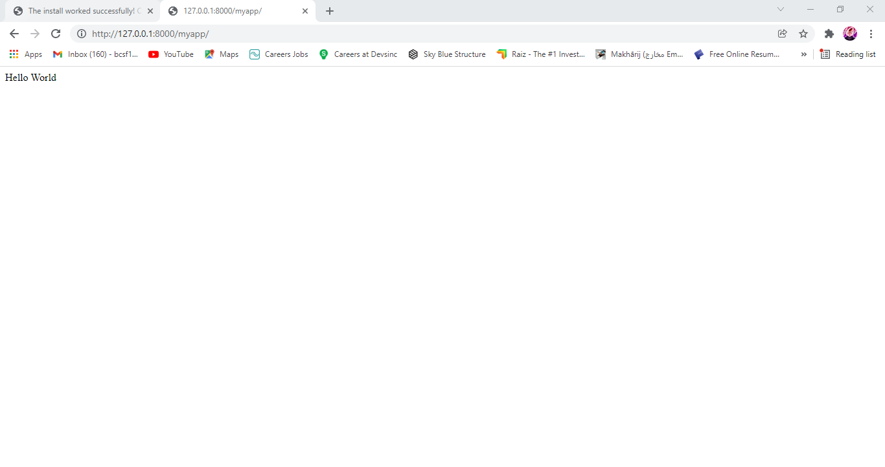
### Congratulation:
You have done it. You have successfully created your first app in django.

# Copyright: Ahsan Riaz
### Repo: https://github.com/AhsanRiaz9/Createing-Your-First-Django-Project
